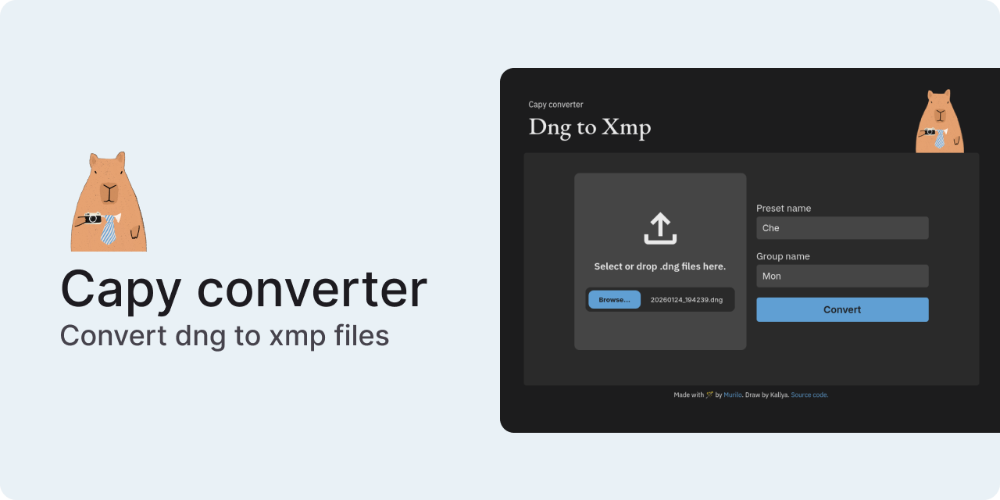

# Capy converter

Dng to xmp files.

Easily convert Adobe Lightroom DNG files to XMP presets for free, directly from your browser.

## About this project

This simple project uses the [exifreader](https://www.npmjs.com/package/exifreader) package to extract XMP metadata from compatible files and compile it into an XML file readable by Adobe Lightroom.

## Disclaimer

- Tested only with Lightroom Mobile.
- Do not disturb the capybara.

## Thanks

Thank you [Kallya](https://www.behance.net/kallyaellen) for the capybara illustrations!
